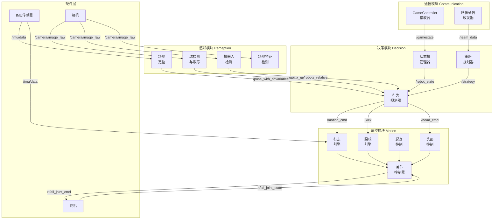
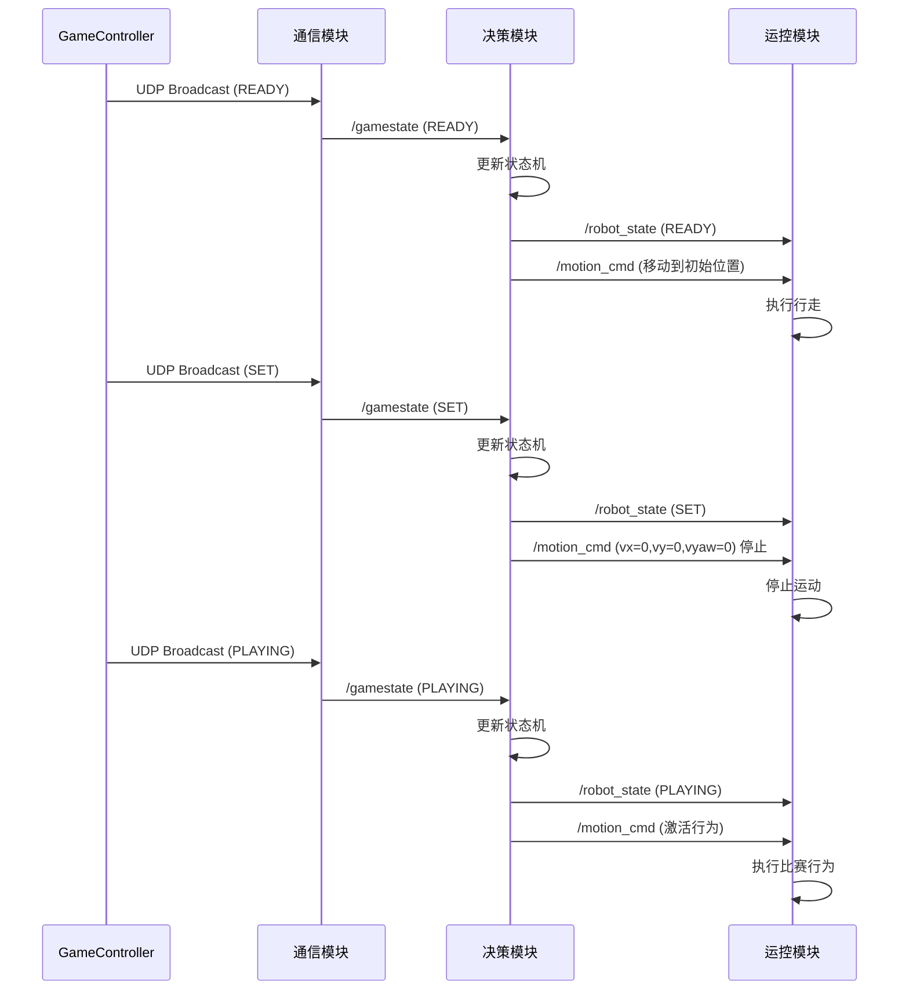
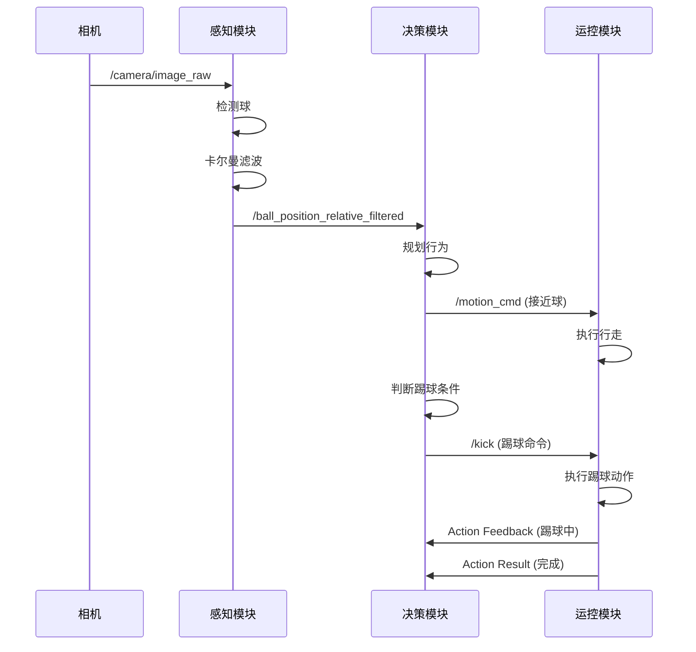
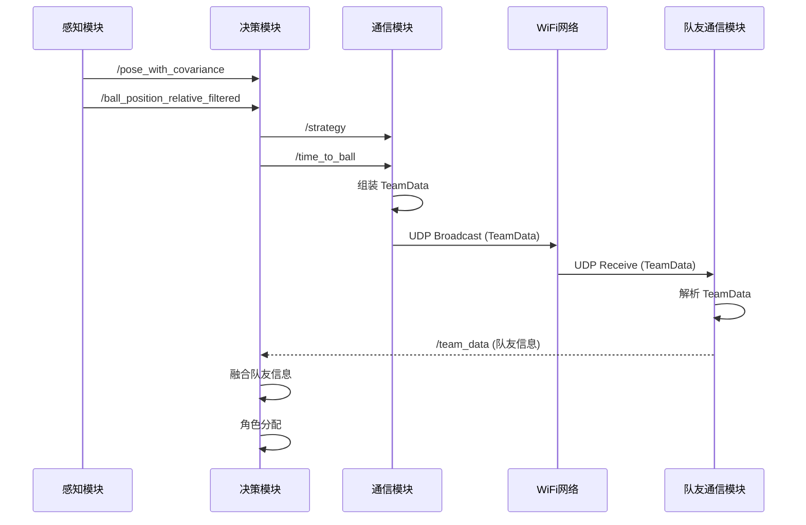

# 设计文档：RoboCup HSL 2026 ROS2 模块间接口规范

## 概述

本设计文档定义了基于 HSL 2026 规则的 RoboCup 人形机器人足球系统的 ROS2 模块间接口技术实现。系统采用模块化架构，分为决策（Decision）、感知（Perception）、运控（Motion）、通信（Communication）四个核心模块，各模块通过 ROS2 话题（Topic）、服务（Service）和动作（Action）进行通信。

### 设计目标

1. **模块解耦**：各模块通过标准化的 ROS2 接口通信，降低模块间耦合度
2. **实时性保证**：关键路径的消息传递延迟控制在 100ms 以内
3. **可靠性**：使用合适的 QoS 配置确保关键消息不丢失
4. **可扩展性**：接口设计支持未来功能扩展和算法替换
5. **规则合规**：所有设计符合 RoboCup HSL 2026 规则要求

### 技术栈

- **ROS2 版本**：Humble Hawksbill
- **通信中间件**：DDS (Cyclone DDS)
- **编程语言**：Python 3.10+ / C++17
- **消息定义**：ROS2 IDL (Interface Definition Language)
- **坐标系管理**：TF2

## 系统架构

### 整体架构图




### 模块职责划分

#### 决策模块（Decision Module）
- 接收并解析 GameController 比赛状态
- 管理机器人状态机（INITIAL, READY, SET, PLAYING, FINISHED）
- 制定比赛策略（进攻/防守）
- 分配机器人角色（守门员、前锋、后卫等）
- 规划具体行为（移动、踢球、转头等）

#### 感知模块（Perception Module）
- 检测和跟踪足球位置与速度
- 检测其他机器人（队友和对手）
- 基于场地特征进行全局定位
- 检测场地线、球门、角旗等特征
- 融合多传感器数据提高感知精度

#### 运控模块（Motion Module）
- 执行行走运动控制
- 执行踢球动作
- 执行起身动作
- 控制头部运动
- 管理关节控制和平衡
- 播放预定义动画

#### 通信模块（Communication Module）
- 接收 GameController UDP 广播
- 发送和接收队伍间通信数据
- 融合队友的感知信息
- 监控网络状态

### 数据流设计

系统的主要数据流如下：

1. **感知到决策流**：感知模块检测球和机器人位置，发布到相应话题，决策模块订阅这些信息进行决策
2. **决策到运控流**：决策模块发布运动命令，运控模块订阅并执行
3. **通信到决策流**：通信模块接收 GameController 和队友信息，发布到话题供决策使用
4. **决策到通信流**：决策模块发布本机器人状态，通信模块订阅并广播给队友
5. **硬件到感知/运控流**：传感器数据（IMU、相机、关节状态）发布到话题供各模块使用

## 组件和接口

### 坐标系定义

系统使用以下标准坐标系：

#### 全局坐标系
- **map**：场地固定坐标系，原点在场地中心，X 轴指向对方球门，Y 轴指向左侧，Z 轴向上
- **odom**：里程计坐标系，随机器人移动累积，用于短期定位

#### 机器人坐标系
- **base_footprint**：机器人底盘中心投影到地面的点，Z=0
- **base_link**：机器人底盘中心
- **imu_link**：IMU 传感器坐标系
- **camera_link**：相机坐标系
- **head_link**：头部坐标系

#### 关节坐标系
- 每个关节有独立的坐标系，命名为 `{joint_name}_link`

#### 坐标系关系
```
map -> odom -> base_footprint -> base_link -> [各关节和传感器坐标系]
```

- `map` 到 `odom` 的变换由感知模块的定位算法发布
- `odom` 到 `base_footprint` 的变换由运控模块的里程计发布
- `base_footprint` 到各关节的变换由机器人 URDF 模型和关节状态计算


### ROS2 话题接口定义

#### 3.1 决策模块接口

##### 发布话题

| 话题名称 | 消息类型 | QoS | 频率 | 说明 |
|---------|---------|-----|------|------|
| `/robot_state` | `BigHeroX_msg/RobotControlState` | TRANSIENT_LOCAL, depth=1 | 事件触发 | 机器人当前状态（INITIAL/READY/SET/PLAYING/FINISHED） |
| `/strategy` | `BigHeroX_msg/Strategy` | RELIABLE, depth=1 | 1-10 Hz | 当前策略（角色、动作、进攻侧） |
| `/motion_cmd` | `BigHeroX_msg/MotionCommand` | RELIABLE, depth=1 | 10-30 Hz | 行走速度命令（对齐 SDK RemoteControlMotion_） |
| `/change_cmd` | `BigHeroX_msg/RobotControlState` | RELIABLE, depth=1 | 事件触发 | 状态/模型切换（对齐 SDK RemoteControlChange_） |
| `/kick` | `BigHeroX_msg/KickGoal` | RELIABLE, depth=1 | 事件触发 | 踢球命令（脚、力度、方向） |
| `/head_cmd` | `BigHeroX_msg/HeadMode` | RELIABLE, depth=1 | 1-5 Hz | 头部控制模式（跟踪球、扫描、固定） |
| `/time_to_ball` | `std_msgs/Float32` | RELIABLE, depth=1 | 5 Hz | 到达球位置的预估时间（秒） |

##### 订阅话题

| 话题名称 | 消息类型 | QoS | 说明 |
|---------|---------|-----|------|
| `/gamestate` | `game_controller_spl_interfaces/GameState` | TRANSIENT_LOCAL, depth=1 | GameController 比赛状态 |
| `/team_data` | `BigHeroX_msg/TeamData` | RELIABLE, depth=10 | 队友共享数据 |
| `/ball_position_relative_filtered` | `geometry_msgs/PoseWithCovarianceStamped` | RELIABLE, depth=1 | 球的相对位置（滤波后） |
| `/pose_with_covariance` | `geometry_msgs/PoseWithCovarianceStamped` | RELIABLE, depth=1 | 机器人全局位姿 |
| `/robots_relative` | `BigHeroX_msg/RobotRelativeArray` | RELIABLE, depth=1 | 检测到的机器人列表 |
| `/imu/data` | `sensor_msgs/Imu` | RELIABLE, depth=1 | IMU 数据（用于跌倒检测） |

#### 3.2 感知模块接口

##### 发布话题

| 话题名称 | 消息类型 | QoS | 频率 | 说明 |
|---------|---------|-----|------|------|
| `/ball_position_relative_filtered` | `geometry_msgs/PoseWithCovarianceStamped` | RELIABLE, depth=1 | 10-30 Hz | 球的相对位置（base_footprint 坐标系） |
| `/ball_velocity` | `geometry_msgs/TwistWithCovarianceStamped` | RELIABLE, depth=1 | 10-30 Hz | 球的速度估计 |
| `/robots_relative` | `BigHeroX_msg/RobotRelativeArray` | RELIABLE, depth=1 | 5-10 Hz | 检测到的机器人（相对位置） |
| `/pose_with_covariance` | `geometry_msgs/PoseWithCovarianceStamped` | RELIABLE, depth=1 | 10-30 Hz | 机器人全局位姿（map 坐标系） |
| `/field_features` | `BigHeroX_msg/FieldFeatureArray` | RELIABLE, depth=1 | 5-10 Hz | 场地特征（线、球门柱等） |
| `/debug/vision` | `sensor_msgs/Image` | BEST_EFFORT, depth=1 | 5-10 Hz | 调试可视化图像 |

##### 订阅话题

| 话题名称 | 消息类型 | QoS | 说明 |
|---------|---------|-----|------|
| `/camera/image_raw` | `sensor_msgs/Image` | BEST_EFFORT, depth=1 | 相机原始图像 |
| `/camera/camera_info` | `sensor_msgs/CameraInfo` | RELIABLE, depth=1 | 相机标定参数 |
| `/imu/data` | `sensor_msgs/Imu` | RELIABLE, depth=1 | IMU 数据（用于定位融合） |
| `/joint_states` | `sensor_msgs/JointState` | RELIABLE, depth=1 | 关节状态（用于运动学计算） |

#### 3.3 运控模块接口

##### 发布话题

| 话题名称 | 消息类型 | QoS | 频率 | 说明 |
|---------|---------|-----|------|------|
| `rt/all_joint_cmd` | `BigHeroX_msg/JointCommand` | RELIABLE, depth=1 | 50-100 Hz | 关节控制命令（对齐 SDK AllJointCmd_） |
| `/walk_engine_debug` | `BigHeroX_msg/WalkEngineDebug` | BEST_EFFORT, depth=1 | 50 Hz | 行走引擎调试信息 |
| `/kick_debug` | `BigHeroX_msg/KickDebug` | BEST_EFFORT, depth=1 | 事件触发 | 踢球调试信息 |
| `/dynup_state` | `std_msgs/String` | RELIABLE, depth=1 | 10 Hz | 起身状态 |
| `/dynup_debug` | `BigHeroX_msg/DynupEngineDebug` | BEST_EFFORT, depth=1 | 10 Hz | 起身调试信息 |
| `/center_of_mass` | `geometry_msgs/PointStamped` | BEST_EFFORT, depth=1 | 50 Hz | 质心位置 |
| `/animation` | `BigHeroX_msg/Animation` | RELIABLE, depth=1 | 事件触发 | 动画播放状态 |

##### 订阅话题

| 话题名称 | 消息类型 | QoS | 说明 |
|---------|---------|-----|------|
| `/motion_cmd` | `BigHeroX_msg/MotionCommand` | RELIABLE, depth=1 | 行走速度命令（对齐 SDK RemoteControlMotion_） |
| `/kick` | `BigHeroX_msg/KickGoal` | RELIABLE, depth=1 | 踢球命令 |
| `/head_cmd` | `BigHeroX_msg/HeadMode` | RELIABLE, depth=1 | 头部控制模式 |
| `rt/all_joint_state` | `BigHeroX_msg/JointState` | RELIABLE, depth=1 | 当前关节状态（对齐 SDK AllJointState_） |
| `/imu/data` | `sensor_msgs/Imu` | RELIABLE, depth=1 | IMU 数据（用于平衡控制） |


#### 3.4 通信模块接口

##### 发布话题

| 话题名称 | 消息类型 | QoS | 频率 | 说明 |
|---------|---------|-----|------|------|
| `/gamestate` | `game_controller_spl_interfaces/GameState` | TRANSIENT_LOCAL, depth=1 | 2 Hz | GameController 比赛状态 |
| `/team_data` | `BigHeroX_msg/TeamData` | RELIABLE, depth=10 | 1-2 Hz | 队伍共享数据（包含队友信息） |
| `/diagnostics` | `diagnostic_msgs/DiagnosticArray` | RELIABLE, depth=1 | 1 Hz | 网络诊断信息 |

##### 订阅话题

| 话题名称 | 消息类型 | QoS | 说明 |
|---------|---------|-----|------|
| `/pose_with_covariance` | `geometry_msgs/PoseWithCovarianceStamped` | RELIABLE, depth=1 | 本机器人位姿（用于队伍通信） |
| `/ball_position_relative_filtered` | `geometry_msgs/PoseWithCovarianceStamped` | RELIABLE, depth=1 | 球位置（用于队伍通信） |
| `/strategy` | `BigHeroX_msg/Strategy` | RELIABLE, depth=1 | 本机器人策略（用于队伍通信） |
| `/motion_cmd` | `BigHeroX_msg/MotionCommand` | RELIABLE, depth=1 | 本机器人速度（用于队伍通信） |
| `/time_to_ball` | `std_msgs/Float32` | RELIABLE, depth=1 | 到球时间（用于队伍通信） |
| `/robots_relative` | `BigHeroX_msg/RobotRelativeArray` | RELIABLE, depth=1 | 检测到的机器人（用于队伍通信） |

### QoS 配置说明

#### RELIABLE vs BEST_EFFORT
- **RELIABLE**：保证消息送达，适用于关键控制命令和状态信息
- **BEST_EFFORT**：不保证送达，适用于高频传感器数据和调试信息

#### TRANSIENT_LOCAL
- 用于状态消息，新订阅者可以立即获取最新状态
- 适用于 `/gamestate`、`/robot_state` 等状态话题

#### Depth（队列深度）
- 控制命令：depth=1（只保留最新命令）
- 传感器数据：depth=1（只保留最新数据）
- 队伍数据：depth=10（保留多个队友的数据）

### Action 接口定义

#### 动画播放 Action

**Action 名称**：`/animation_action`

**Goal**：
```
std_msgs/Header header
int64 timestamp           # 纳秒时间戳
int64 index               # 消息序列号
string animation          # 动画名称，对应 RemoteControlChange_ model 值
bool hcm                  # 是否来自 HCM（高优先级）
bool bounds               # 是否检查关节限位
uint8 start               # 起始帧
uint8 end                 # 结束帧
```

**Result**：
```
bool successful
```

**Feedback**：
```
uint8 percent_done
```

#### 踢球 Action

**Action 名称**：`/dynamic_kick`

**Goal**：
```
std_msgs/Header header
int64 timestamp           # 纳秒时间戳
int64 index               # 消息序列号
geometry_msgs/Point ball_position
geometry_msgs/Vector3 kick_direction
float32 kick_speed
uint8 FOOT_LEFT = 1
uint8 FOOT_RIGHT = 2
uint8 kick_foot
```

**Result**：
```
bool success
string message
```

**Feedback**：
```
string state              # 当前状态（APPROACHING, KICKING, FINISHING）
float32 distance_to_ball
```


## 数据模型

### 核心消息定义

#### RobotControlState（机器人控制状态）

```
std_msgs/Header header
int64 timestamp
int64 index

uint8 STATE_INITIAL = 0
uint8 STATE_READY = 1
uint8 STATE_SET = 2
uint8 STATE_PLAYING = 3
uint8 STATE_FINISHED = 4
uint8 state              # RoboCup 比赛状态

# 对齐 SDK RemoteControlChange_（话题 /change_cmd）
string change_key        # "status" | "model" | "name"
string change_value      # 对应枚举值
```

**说明**：兼容两种模式——`state` 字段对应 GameController 比赛状态；`change_key/change_value` 对齐 SDK `RemoteControlChange_` 的 key-value 切换接口。

#### Strategy（策略）

```
std_msgs/Header header
int64 timestamp
int64 index

# 角色定义
uint8 ROLE_UNDEFINED = 0
uint8 ROLE_IDLING = 1
uint8 ROLE_OTHER = 2
uint8 ROLE_STRIKER = 3      # 前锋
uint8 ROLE_SUPPORTER = 4    # 支援
uint8 ROLE_DEFENDER = 5     # 后卫
uint8 ROLE_GOALIE = 6       # 守门员
uint8 role

# 动作定义
uint8 ACTION_UNDEFINED = 0
uint8 ACTION_POSITIONING = 1      # 定位
uint8 ACTION_GOING_TO_BALL = 2    # 前往球
uint8 ACTION_TRYING_TO_SCORE = 3  # 尝试得分
uint8 ACTION_WAITING = 4          # 等待
uint8 ACTION_KICKING = 5          # 踢球
uint8 ACTION_SEARCHING = 6        # 搜索
uint8 ACTION_LOCALIZING = 7       # 定位中
uint8 action

# 进攻侧
uint8 SIDE_UNDEFINED = 0
uint8 SIDE_LEFT = 1
uint8 SIDE_MIDDLE = 2
uint8 SIDE_RIGHT = 3
uint8 offensive_side
```

**说明**：描述机器人的策略，包括角色、当前动作和进攻侧。

#### TeamData（队伍数据）

```
std_msgs/Header header
int64 timestamp
int64 index

uint8 robot_id

uint8 STATE_UNKNOWN = 0
uint8 STATE_UNPENALIZED = 1
uint8 STATE_PENALIZED = 2
uint8 state

# 机器人位姿（map 坐标系）
geometry_msgs/PoseWithCovariance robot_position

# 球位置（map 坐标系）
geometry_msgs/PoseWithCovariance ball_absolute

# 检测到的机器人
RobotRelativeArray robots

# 到球时间
float32 time_to_position_at_ball

# 策略
Strategy strategy
```

**说明**：队伍通信数据包，包含机器人状态、位姿、球位置、策略等信息。

#### RobotRelative（相对机器人）

```
# 机器人类型
uint8 TYPE_UNKNOWN = 0
uint8 TYPE_TEAMMATE = 1
uint8 TYPE_OPPONENT = 2
uint8 type

# 置信度 [0.0, 1.0]
float32 confidence

# 相对位置（base_footprint 坐标系）
geometry_msgs/Point position

# 协方差（可选）
float32[9] covariance
```

**说明**：检测到的机器人信息，包括类型、置信度和相对位置。

#### RobotRelativeArray（机器人数组）

```
std_msgs/Header header
int64 timestamp
int64 index
RobotRelative[] robots
```

#### FieldFeatureArray（场地特征数组）

```
std_msgs/Header header
int64 timestamp
int64 index
FieldFeature[] features
```

#### HeadMode（头部模式）

```
std_msgs/Header header
int64 timestamp
int64 index

uint8 MODE_FIXED = 0           # 固定方向
uint8 MODE_TRACK_BALL = 1      # 跟踪球
uint8 MODE_SCAN_FIELD = 2      # 扫描场地
uint8 MODE_LOOK_AT_POINT = 3   # 看向指定点
uint8 mode

# 当 mode=MODE_LOOK_AT_POINT 时使用
geometry_msgs/Point target_point

# 当 mode=MODE_FIXED 时使用（关节角度）
float32 pan_angle   # 水平角度（弧度）
float32 tilt_angle  # 俯仰角度（弧度）
```

**说明**：头部控制模式，支持固定、跟踪球、扫描场地等模式。


#### JointCommand（关节命令）

```
std_msgs/Header header   # ROS2 内部使用

# 元数据（对齐 SDK AllJointCmd_）
int64 timestamp          # 纳秒时间戳，对齐 timestamp_
int64 index              # 消息序列号，对齐 index_
uint8 cmd_type           # 控制模式，对齐 cmd_type_

bool from_hcm            # 是否来自 HCM（高优先级，ROS2 内部语义）

string[] joint_names     # 关节名称（ROS2 内部使用，SDK 按索引访问）

# 控制参数（对齐 SDK JointCmd_ 字段）
float64[] joint_pos      # 关节目标位置（rad），对齐 joint_pos_
float64[] joint_vel      # 关节目标速度（rad/s），对齐 joint_vel_
float64[] joint_torque   # 关节目标力矩（N·m），对齐 joint_torque_
float64[] kp             # 位置控制比例系数，对齐 kp_
float64[] kd             # 速度控制比例系数，对齐 kd_
```

**说明**：关节控制命令，对齐 SDK `AllJointCmd_` + `JointCmd_` 结构。话题 `rt/all_joint_cmd`（底层 DDS 接口）。

#### KickGoal（踢球目标）

```
std_msgs/Header header
int64 timestamp
int64 index

uint8 FOOT_LEFT = 1
uint8 FOOT_RIGHT = 2
uint8 kick_foot

float32 kick_strength   # 踢球力度 [0.0, 1.0]
float32 kick_direction  # 踢球方向（相对于机器人朝向，弧度）

geometry_msgs/Point ball_position  # 球的相对位置（base_footprint 坐标系）
```

**说明**：踢球命令，指定踢球脚、力度和方向。

#### FieldFeature（场地特征）

```
uint8 TYPE_LINE = 0
uint8 TYPE_GOALPOST = 1
uint8 TYPE_CORNER = 2
uint8 TYPE_T_JUNCTION = 3
uint8 TYPE_X_JUNCTION = 4
uint8 type

# 特征位置（相对坐标系）
geometry_msgs/Point position

# 特征方向（对于线段）
geometry_msgs/Vector3 direction

# 置信度 [0.0, 1.0]
float32 confidence
```

### 时序图

#### 比赛状态转换时序



#### 球检测与踢球时序



#### 队伍通信时序




